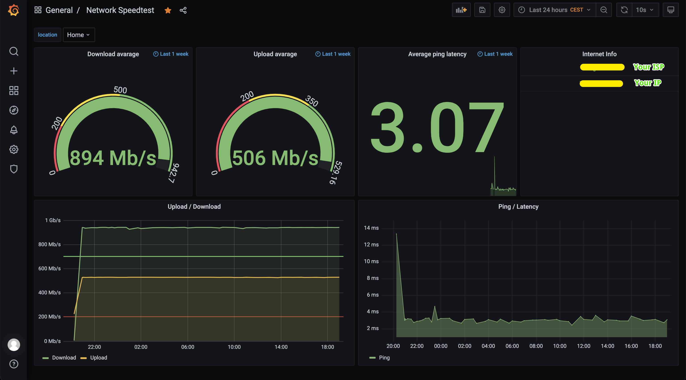

# Network Speed Monitor Docker

A network speed monitoring stack that built with InfluxDB, Grafana and Speedtest CLI

## Prerequisite
- Docker & Docker-compose installed
- Git installed

## Getting started
- Clone this repo
- Update `.env` file following the guide below
- Run `docker-compose up -d`
- Visit `http://localhost:<GRAFANA_PORT>` to view the statistics. The default credentials are `admin:admin`, Grafana will ask you to change your password the first time

## Update env file
- Run `cp .env.sample .env` and change the environment variables as you wish in `.env`
- Config `CRON_CONFIG` following [node-cron syntax](https://www.npmjs.com/package/node-cron)
- Get `SPEEDTEST_SERVER_ID` value from [this link](https://sparanoid.com/lab/speedtest-list/)

## Showcase
